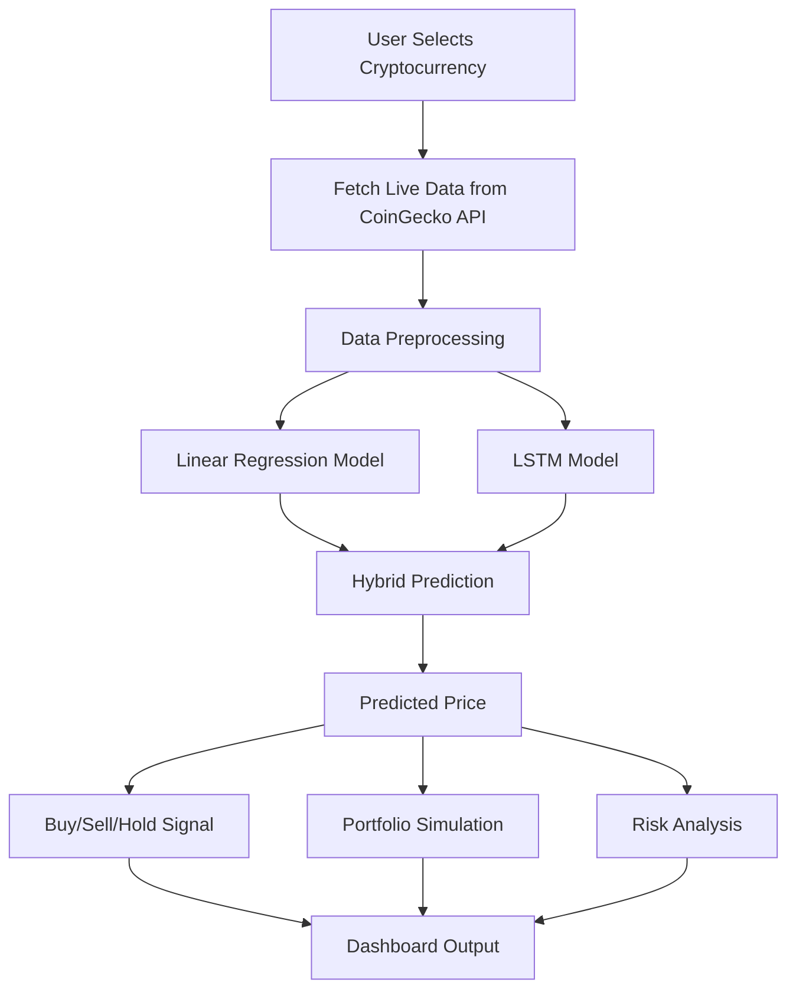
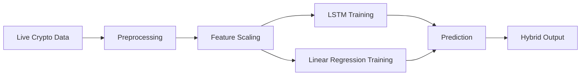

# 🚀 Crypto Price Prediction System

A professional AI-powered cryptocurrency price prediction system built using **Streamlit, Linear Regression, and LSTM (Long Short-Term Memory)**. The project predicts future cryptocurrency prices and provides **Buy/Sell/Hold recommendations**, **risk analysis**, and **portfolio simulation**.

## 📌 Features

- ✅ Real-time cryptocurrency data fetching using CoinGecko API
- ✅ Supports **Bitcoin, Ethereum, Litecoin**
- ✅ **Hybrid Prediction Model** (Linear Regression + LSTM)
- ✅ Premium Streamlit dashboard UI
- ✅ Interactive price visualization using Plotly
- ✅ AI-based Buy / Sell / Hold signals
- ✅ Risk analysis using market volatility
- ✅ Portfolio profit/loss simulation
- ✅ Black & Gold premium crypto theme

## 🏗️ System Architecture



## 🧠 Workflow Diagram



## 🛠️ Tech Stack

- Python
- Streamlit
- TensorFlow/Keras
- Scikit-Learn
- Plotly
- Pandas & NumPy
- CoinGecko API

## ⚙️ Installation

```bash
pip install streamlit tensorflow scikit-learn pandas numpy plotly requests
streamlit run app.py
```

## 👨‍💻 Author

**Nagesh Dandime**  
LinkedIn: https://www.linkedin.com/in/nagesh-dandime
